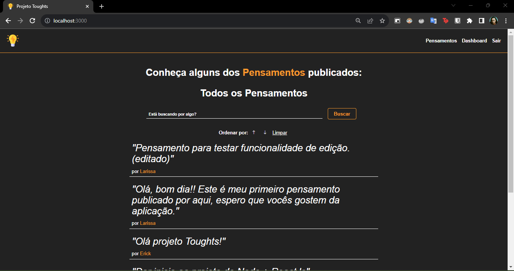
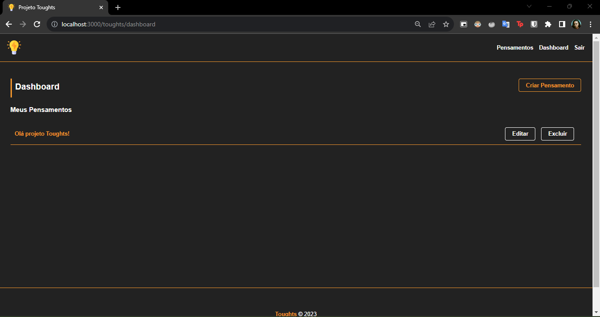
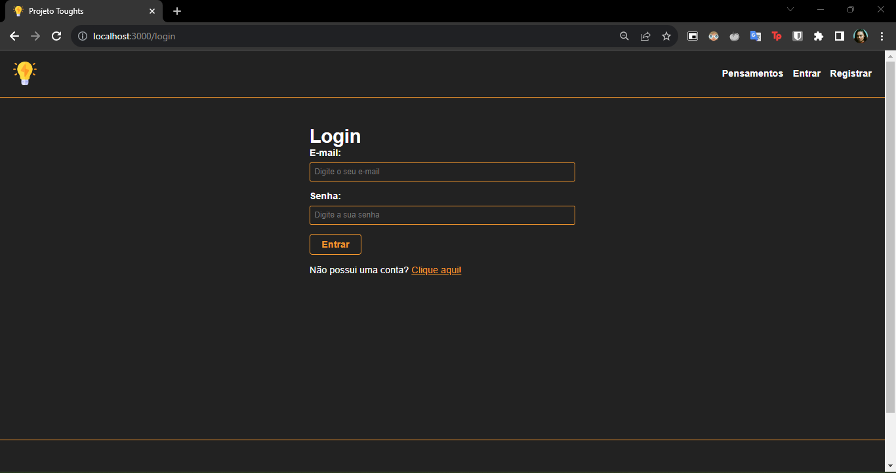
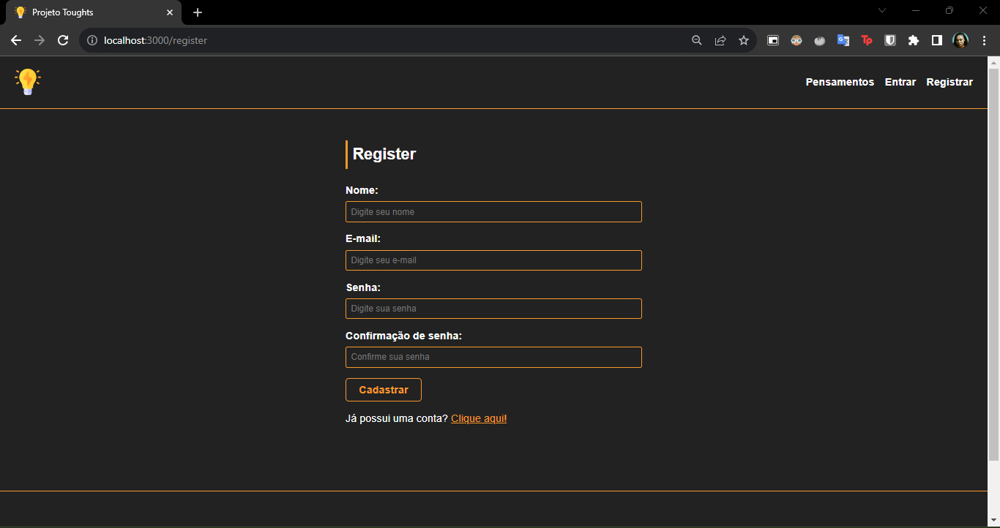

# -Projeto Toughts (Pensamentos)  -

## 📖 Introdução
Este projeto Toughts foi desenvolvido com o intuito de revisitar e aprimorar mais os meus conhecimentos em Node.Js, MySQL e aprender a utilizar a ORM Sequelize para facilitar as queries nas tabelas do banco de dados.

O projeto Toughts foi desenvolvido com a ajuda do curso <b>"Node.js do Zero a Maestria"</b> do instrutor Matheus Battisti da plataforma de cursos Online <b>Udemy</b>
<br>
<br>
<br>


## 👨‍💻 Desenvolvido Por:
| [<br><sub>Henrique Batista</sub>](https://github.com/HenriqBatista)|
|:---:|

<br>
<br>
<br>

## 📝 Passos para executar o Projeto em sua máquina:

```bash
# Preparando ambiente
## Obs: fazer a instalação do Xampp para ter um servidor de Mysql em sua maquina e do MySQL Workbench para fazer a visualização das tabelas do banco de dados.

# Instalando as dependências
npm install

# Executando o projeto
npm start
```
<br>
<br>

## 💻 Preview do Projeto
<br><sub>Home da Aplicação<sub><br>
<br>
<br>

<br><sub>Dashboard da Aplicação<sub>
<br>
<br>

<br><sub>Login da Aplicação<sub>
<br>
<br>

<br><sub>Register da Aplicação<sub>
<br>

## 💻 Funcionalidades

A Aplicação conta com sistema de Autenticação e Autorização, logo para ter acesso as funcionalidades de Criação, Edição e Exclusão de pensamentos, é necessário fazer o registro ou login de uma conta.
Após efetuar login, o usuário tem como funcionalidades ja implementadas, a criação de pensamentos, edição e exclusão dos pensamentos.

Funcionalidades a serem desenvolvidas na aplicação: Sistema de Likes e comentários nos pensamentos de outros usuários.

<br>
<br>
<br>

## 📚 Conteúdos Abordados

````bash
NodeJS
Javascript
Express
MySQL
POO
Arquitetura MVC
Geração de hashes
Autenticação e autorização
Roteamento
Cookie
HTML (handlebars)
CSS
````
<br>
<br>


## 💡Programas utilizados:
- VSCode
- Xampp
- MySQL Workbench

<br>
<br>
<br>

# 📫 Contatos

📧 E-mail: henriq.batista.veloso@gmail.com

[](https://www.linkedin.com/in/henrique-batista-veloso/)


